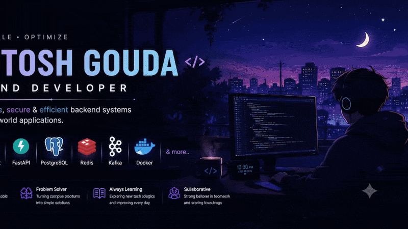

 

<h1 align="center">
Hi 👋, I'm Ashutosh Gouda
</h1>

<h3 align="center">
Backend Developer | Spring Boot | Java | FastAPI | PostgreSQL
</h3>

  

### 🚀 About Me

- 🔭 Currently working on **DashMate**
- 💼 Backend Developer at **Runamarga Private Limited**
- 🌱 Learning **AWS, DevOps, React**
- 💬 Ask me about **Spring Boot, Java, FastAPI**
- ⚡ Passionate about **Backend Architecture** and **Scalable Systems**

---

### Project 

#### 🚀 Featured Projects

### DashMate
🚚 Delivery Management Platform

Tech:
Spring Boot • PostgreSQL • Redis • Kafka

Features
- JWT Authentication
- Live Order Tracking
- Role-Based Access Control
- Docker Deployment 

### HRMS

Production HR Management System
Tech
FastAPI • PostgreSQL • Redis
Features
- 45+ REST APIs
- Attendance
- Leave
- Authentication
- RBAC

##Tech Stack

 ## Technologies

  
  &nbsp;&nbsp;&nbsp;
  
  &nbsp;&nbsp;&nbsp;
  
  &nbsp;&nbsp;&nbsp;
  
  &nbsp;&nbsp;&nbsp;
  
  &nbsp;&nbsp;&nbsp;
  
  &nbsp;&nbsp;&nbsp;
  
  &nbsp;&nbsp;&nbsp;
  

 
 

### 🌐 Contact Me
Contact

&nbsp;&nbsp;&nbsp;&nbsp;

&nbsp;&nbsp;&nbsp;&nbsp;

## GitHub

<!-- Profile Overview -->

  

 

 

<!-- GitHub Analytics -->
<table align="center">
  <tr>
    <td align="center" width="50%">
      
    </td>
    <td align="center" width="50%">
      
    </td>
  </tr>

  <tr>
    <td align="center" width="50%">
      
    </td>
    <td align="center" width="50%">
    </td>
  </tr>
</table>

